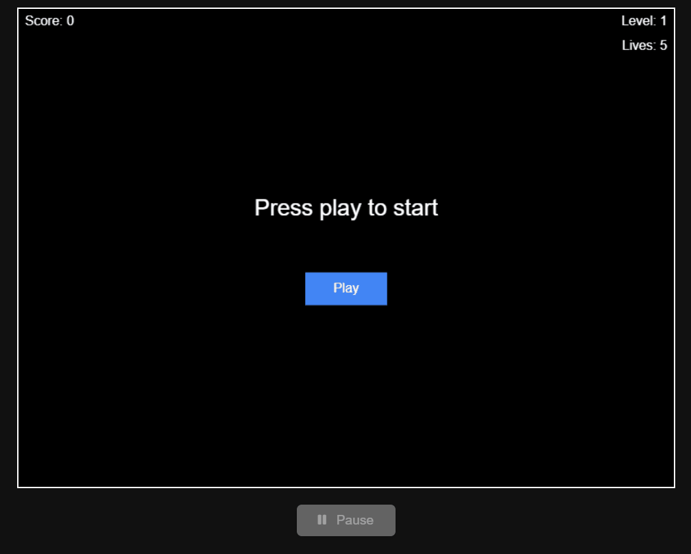

# Ball and Paddle Game
A simple and elegant Ball-and-Paddle browser game built with plain HTML, CSS, and JavaScript.

## 🚀 Live Demo
Play it here:
[Live Ball and Paddle Game](https://rytvee.github.io/ball-and-paddle/)

## 📌 Features
- Ball bouncing off walls and paddle
- Simple collision detection
- Keyboard controls for paddle movement
- Pure HTML/CSS/JavaScript (no external libraries)
- Score Counter: Increment points when the ball hits the paddle successfully
- Level Counter: Increment levels after every 5 points
- Speed Variation: Ball speed increases to ramp up difficulty
- Mobile Support: Touch controls for mobile gameplay

## 📂 Folder Structure
```text
tic-tac-toe/
│── index.html        # Main game layout
│── style.css         # Styling for the game board & UI
│── game.js           # Game logic (players, computer AI, score)
│── sounds/           # music, sounds 
└── images/           # Icon, game play gif
```

## 🎮 Gameplay Overview

| Part                   | Role                                                                                          |
| ---------------------- | --------------------------------------------------------------------------------------------- |
| **Ball**               | Moves up/down & bounces off walls and paddle. Position updates using `requestAnimationFrame`. |
| **Paddle**             | Controlled by user (move left/right or up/down depending on implementation).                  |
| **Collision Logic**    | Detects overlap between ball and paddle or walls. Reverses direction upon impact.             |
| **Scoring**            | Tracks hits and keeps points.                                                                 |


## 🎮 Game Play



## 📜 License
This project is open for learning and free to use!
Feel free to modify, extend, or integrate it however you like.
